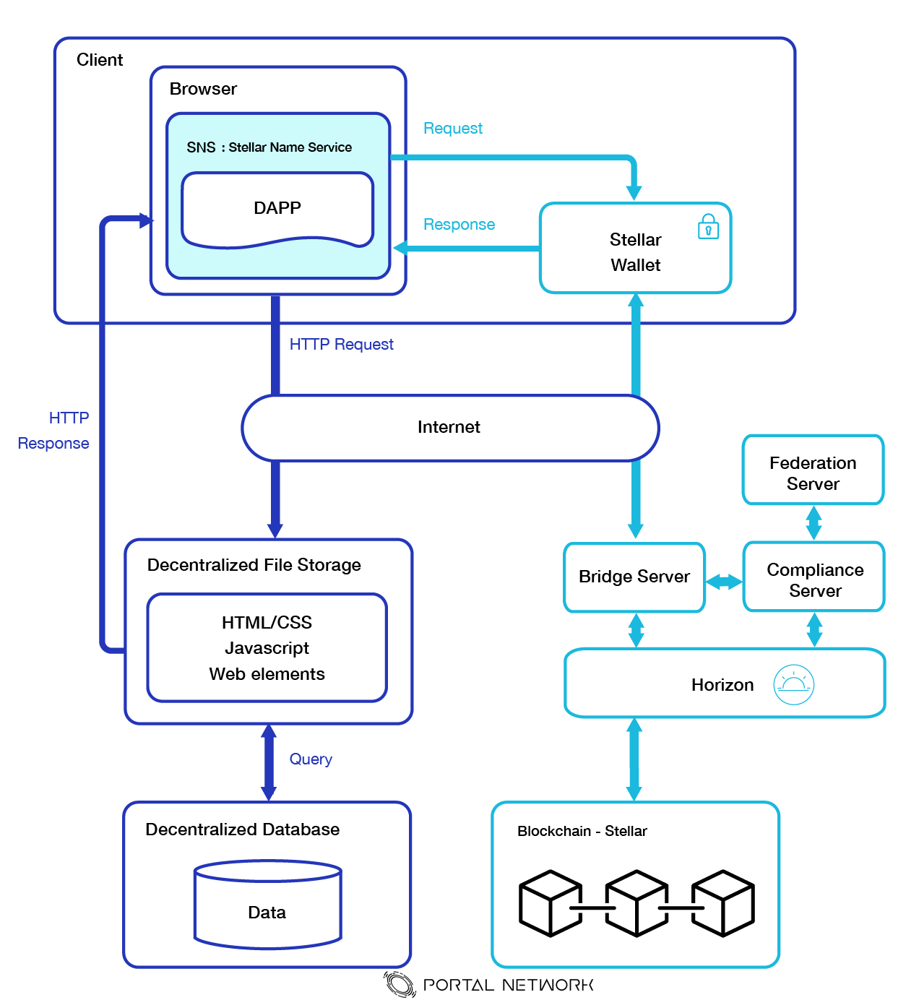
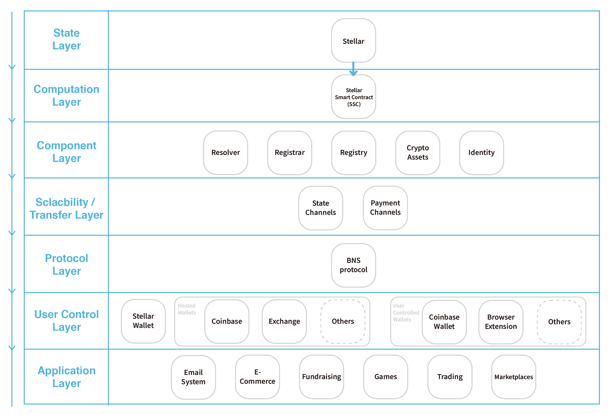
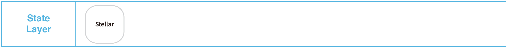
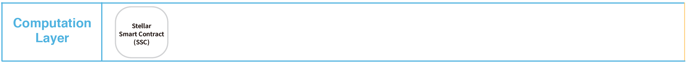
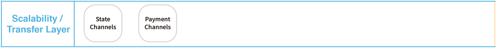
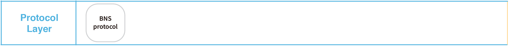

> 📖🔍 Documents of the Stellar Name Service.

# Overview

## 💡 What is Stellar?
Stellar also known as Stellar Lumen, is a pragmatic blockchain project that aims to function as a bridge between the opposing worlds of cryptocurrency and traditional centralized financial institutions.

## 💡 What is BNS?
BNS – or blockchain name system – is the protocol on the internet that turns human-comprehensible decentralized website names such as 'website.xlm' or 'mywebsite.xlm' into addresses understandable by decentralized network machines.

## 📝 Description
SNS is the Stellar Name Service, a distributed, open, and extensible naming system based on the Stellar blockchain. 

## 📚 Documents

#### Table of Contents
- [Introduction](./docs/INTRODUCTION.md)

## ⌨️ Stellar Development
- [Support Languages](https://www.stellar.org/developers/reference/)
    - [Go](https://www.stellar.org/developers/go/reference/index.html)
    - [Java](https://github.com/stellar/java-stellar-sdk)
    - [JavaScript](https://www.stellar.org/developers/js-stellar-sdk/reference/index.html)
- [REST APIs](https://www.stellar.org/developers/horizon/reference/index.html)
- [Stellar Smart Contract](https://www.stellar.org/developers/guides/walkthroughs/stellar-smart-contracts.html)

## Stellar in Web3.0
Stellar plays an connecting and entry layer in Web3.0 services. It connects with Stellar wallet, bridge server, compliance server, federation server, horizon and stellar blockchain.

### The description of compositions in Web3.0

#### Bridge Server
Stellar.org maintains a bridge server, which makes it easier to use the federation and compliance servers to send and receive payments. When using the bridge server, the only code you need to write is a private service to receive payment notifications and respond to regulatory checks from the bridge and compliance servers.

#### Federation Server
The Stellar federation protocol allows convert a human-readable address like `amy*your_org.com` to an account ID. It also includes information about what should be in a transaction’s `memo`. When sending a payment, you contact a federation server first to determine what Stellar account ID to pay. Luckily, the bridge server does this for you.

#### Compliance Server
The task of an anchor is handling regulatory compliance, like Anti-Money Laundering (AML). To accomplish that, you should use the Stellar compliance protocol, a standard way to exchange compliance information and pre-approve a transaction with another financial institution.

You can write your own server that matches the compliance protocol, but Stellar.org also provides a compliance server that takes care of most of the work for you.

Your bridge server contacts your compliance server in order to authorize a transaction before sending it. Your compliance server uses the compliance protocol to clear the transaction with the recipient’s compliance server, then lets the bridge server know the transaction is ok to send.

#### Horizon
Horizon is the client-facing API server for the Stellar ecosystem. It acts as the interface between Stellar Core and applications that want to access the Stellar network. Horizon allows you to submit transactions to the network, check the status of accounts, and subscribe to event streams. For more details, see an overview of the Stellar network.

## 🗂️ Stellar Tech Stack
Stellar Name Service(Stellar-NS) governs by the Stellar Smart Contract(SSC) with three abstract components, registrar, registry, and resolver. Those three main smart contracts components represent the three responsibilities for the best practice of the current naming system. 
The registry stores a list of every domain (and subdomain, and sub-sub-domain, and so forth) and the related ownership information. 
The registrar governs the registering process for the specific domain. The mechanism design for the process should consider how to prevent the collusion and economical efficiency.
The resolver is in charge of resolving the universal mapping logic from wallet address, contract address, decentralized content address, and many more.

### State Layer
Stellar serves as the core blockchain network in state layer. The state layer is the abstraction that each participant owns their state information and transactions history based on blockchain identities. Stellar-NS stores the related information in this layer.

### Computation Layer
Developres can utilize different programming languages to implement their business logic to the smart contract such as Golang, Javascript, and Java, and many more languages maintained by the communities. The Stellar Smart Contract is implemented mainly by the multisignature from the related parties, operations in batching and atomicity, sequence way, and time bounds process.

### Component Layer
The design of digital assets can have more functions by combing the State Layer and Computation Layer, such as crypto assets, and identities. We can modularize mechanism design and economical model into different components.

### Scalability / Transfer Layer
The native advantage of Stellar is lighting transaction abilities. The future support of state channel and current support payment channel abilities greatly solve the pain point when transferring crypto assets.

### Protocol Layer
The BNS protocol is a standard which can make the Stellar Name Service more efficient. The protocol connects different layers together and increase more business capacity, enhance the usability and reduce the complexity.

### User Control Layer
This layer is in charge of managing a user’s private keys and the interaction with the State Layer. Stellar-NS plays a crucial rule to transfer hashes to human-recognizable names. Stellar wallet and browser extensions can resolver Stellar domain to wallet address, contract address, different protocol hash.

### Application Layer
The above components provided by different layers unleashes more real business opportunities. For example, developers can utilize the tech stacks to build a decentralized art auction system which can interact with the Stellar and host on IPFS. Users can view the decentralized resources through simply typing yourauction.xlm on the domain URL bar with our further enhancement in the browser extension. 

## Stellar Testnet

## Stellar Wallet

## 🔗 Resources
- [Official Website](https://www.stellar.org/)

## 📣 Contributing
See [CONTRIBUTING.md](./CONTRIBUTING.md) for how to help out.

## 🗒 Licence
See [LICENSE](./LICENSE) for details.
