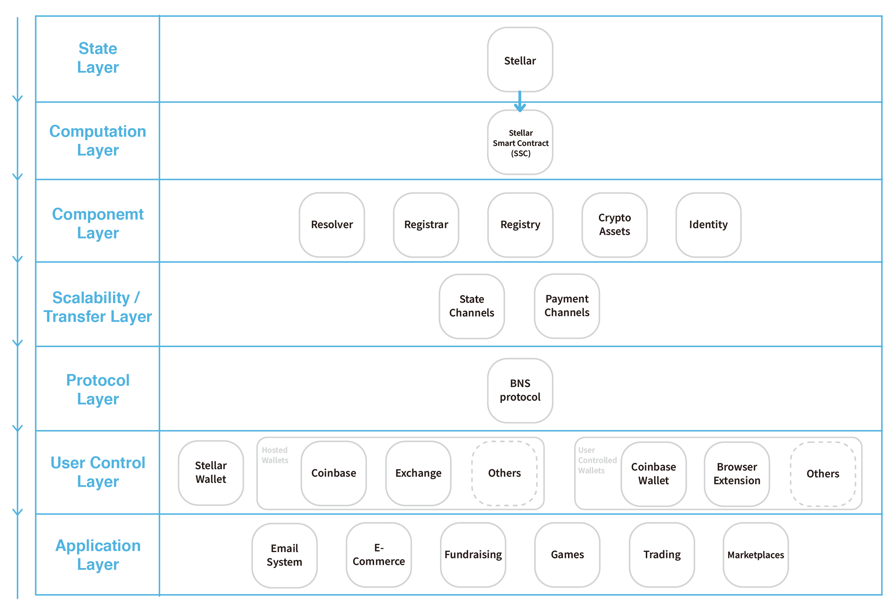

> 📖🔍 Documents of the Stellar Name Service.

# Overview

## 💡 What is Stellar?
Stellar also known as Stellar Lumen, is a pragmatic blockchain project that aims to function as a bridge between the opposing worlds of cryptocurrency and traditional centralized financial institutions.

## 💡 What is BNS?
BNS – or blockchain name system – is the protocol on the internet that turns human-comprehensible decentralized website names such as 'website.xlm' or 'mywebsite.xlm' into addresses understandable by decentralized network machines.

## 📝 Description
SNS is the Stellar Name Service, a distributed, open, and extensible naming system based on the Stellar blockchain. 

## 📚 Documents

#### Table of Contents
- [Introduction](./docs/INTRODUCTION.md)

## ⌨️ Stellar Smart Contract
- [Stellar Smart Contract](https://www.stellar.org/developers/guides/walkthroughs/stellar-smart-contracts.html)

## Stellar in Web3.0
Stellar plays an connecting and entry layer in Web3.0 services. It connects with Stellar wallet, bridge server, compliance server, federation server, horizon and stellar blockchain.

## 🗂️ Stellar Tech Stack

### State Layer

### Computation Layer

### Component Layer

### Scalability / Transfer Layer

### Protocol Layer

### User Control Layer

### Application Layer

## Stellar Wallet

## Stellar Testnet

## 🔗 Resources
- [Official Website](https://www.stellar.org/)

## 📣 Contributing
See [CONTRIBUTING.md](./CONTRIBUTING.md) for how to help out.

## 🗒 Licence
See [LICENSE](./LICENSE) for details.
